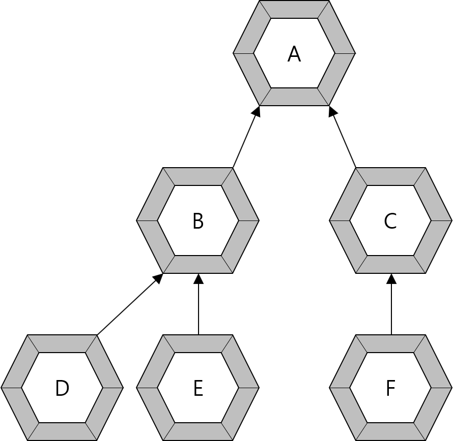

# 7장 상속 Inheritance
## 확인문제

1. 자바의 상속에 대한 설명 중 틀린 것은 무엇입니까?  
  ① 자바는 다중 상속을 허용한다.  
  ② 부모의 메소드를 자식 클래스에서 재정의(오버라이딩)할 수 있다.  
  ③ 부모의 private 접근 제한을 갖는 필드와 메소드는 상속의 대상이 아니다.  
  ④ final 클래스는 상속할 수 없고, final 메소드는 오버라이딩 할 수 없다.  

> 답 : 1  
부모 클래스의 자식 클래스는 그 수에 제한이 없지만, 자식 클래스는 하나의 부모 클래스만 가질 수 있다. ~~cf) 자웅동체~~  

---
2. 클래스 타입 변환에 대한 설명 중 틀린 것은 무엇입니까?  
  ① 자식 객체는 부모 타입으로 자동 타입 변환된다.  
  ② 부모 객체는 항상 자식 타입으로 강제 타입 변환된다.  
  ③ 자동 타입 변환을 이용해서 필드와 매개 변수의 다형성을 구현한다.  
  ④ 강제 타입 변환 전에 instanceof 연산자로 변환 가능한지 검사하는 것이 좋다.  

  > 답 : 2  
부모 객체가 이전에 자식 객체와 동일한 타입이었을 경우에만 가능하다.  

---
3. final 카워드에 개한 설명으로 틀린 것은?  
  ① final 클래스는 부모 클래스로 사용할 수 있다.  
  ② final 필드는 값이 저장된 후에는 변경할 수 없다.  
  ③ final 메소드는 재정의(오버라이딩)할 수 없다.  
  ④ static final 필드는 상수를 말한다.  

  > 답 : 1  
final 클래스는 부모 객체가 될 수 없다.  

---
4. 오버라이딩(Overriding)에 대한 설명으로 틀린 것은?  
  ① 부모 메소드의 시그너처(리턴 타입, 메소드명, 매개 변수)와 동일해야 한다.  
  ② 부모 메소드보다 좁은 접근 제한자를 붙일 수 없다.(ex: public(부모) → private(자식))  
  ③ @Override 어노테이션을 사용하면 재정의가 확실한지 컴파일러가 검증한다.  
  ④ protected 접근 제한을 갖는 메소드는 다른 패키지의 자식 클래스에서 재정의할 수 없다.  

  > 답 : 4  
다른 패키지라 하더라도, 자식 클래스에서 부모 클래스의 protected 접근 제한을 가지는 메소드도 재정의할 수 있다.  

---
5. Parent 클래스를 상속해서 Child 클래스를 다음과 같이 작성했는데, Child 클래스의 생성자에서 컴파일 에러가 발생했습니다. 그 이유를 설명해보세요.  

【Parent.java】  
```java
public class Parent {
        public String name;

        public Parent(String name) { this.name = name; }
}
```
【Child.java】  
```java
public class Child extends Parent {
        private int studentNo;

        public Child(String name, int studentNo) {
                this.name = name;
                this.studentNo = studentNo;
        }
}
```

> Child 클래스에서 부모 클래스인 Parent의 매개 변수를 가지는 생성자가 작성되었으므로, 자식 클래스에서 해당 부모 클래스를 호출하는 super(name)이 누락되었기 때문에 컴파일 에러가 발생한다.

---
6. Parent 클래스를 상속받아 Child 클래스를 다음과 같이 작성했습니다. ChildExample 클래스를 실행했을 때 호출되는 각 클래스의 생성자의 순서를 생각하면서 출력 결과를 작성해보세요.  

【Parent.java】  
```java
public class Parent {
        public String nation;

        public Parent() {
                this("대한민국");
                System.out.println("Parent() call");
        }

        public Parent(String nation) {
                this.nation = nation;
                System.out.println("Parent(String nation) call");
        }
}
```
【Child.java】  
```java
public class Child extends Parent {
        private String name;

        public Child() {
                this("홍길동");
                System.out.println("Child() call");
        }

        public Child(String name) {
                this.name = name;
                System.out.println("Child(String name) call");
        }
}
```
【ChildExample.java】  
```java
public class ChildExample {
        public static void main(String[] args) {
                Child child = new Child();
        }
}
```
> Parent(String nation) → Parent() → Child(String name) → Child() 순으로 출력된다. super()는 this()와 같이 있을 수 없다. 왜냐하면 두 생성자 모두 첫 줄에 와야 하기 때문이다. 따라서 this()로 넘어간 다음 생성자 첫 줄에 super()가 자동 생성된다. Child(String name) 생성자에서 직접 작성되지는 않았지만, super()가 생략되었다고 볼 수 있다.  

---
7. Tire 클래스를 상속받아 SnowTire 클래스를 다음과 같이 작성했습니다. SnowTireExample 클래스를 실행했을 때 출력 결과는 무엇일까요?  

【Tire.java】  
```java
public class Tire {
        public void run() {
                System.out.println("일반 타이어가 굴러갑니다.");
        }
}
```
【SnowTire.java】  
```java
public class SnowTire extends Tire {
        @Override
        public void run() {
                System.out.println("스노우 타이어가 굴러갑니다.");
        }
}
```
【SnowTireExample.java】  
```java
public class SnowTireExample {
        public static void main(String[] args) {
                SnowTire snowTire = new SnowTire();
                Tire tire = snowTire;

                snowTire.run();
                tire.run();
        }
}
```
> 출력 결과
> ```text
> 스노우 타이어가 굴러갑니다.
> 스노우 타이어가 굴러갑니다.
> ```
> 아무리 부모 클래스 타입에 자식 클래스를 Promotion 하더라도 Override된 메소드는 자식 객체의 메소드를 따른다.  

---
8. A, B, C, D, E, F 클래스가 다음과 같이 상속 관계에 있을 때 다음 빈칸에 올 수 없는 코드는?  
  
```java
B b = (      );

메소드 선언 : void method(B b) {...}
메소드 호출 : method((        ))
```
  ① new B()  
  ② (B) new A()\t//강제 타입 변환  
  ③ new D()\t//자동 타입 변환  
  ④ new E()\t//자동 타입 변환  

> 답 : 2  
부모 클래스가 자식 클래스로 Casting 되기 위해서는 child-(promotion)>parent-(casting)>child 일 경우만 가능하다.